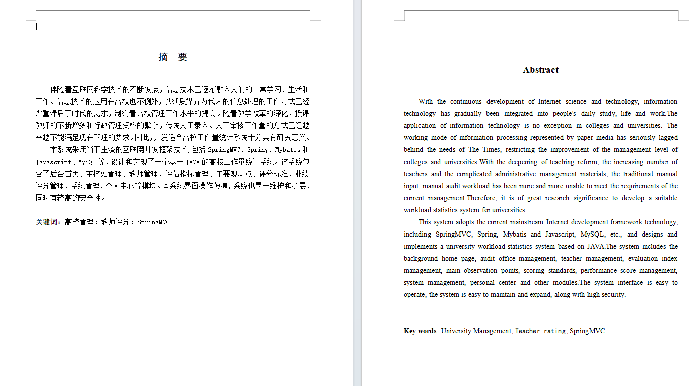
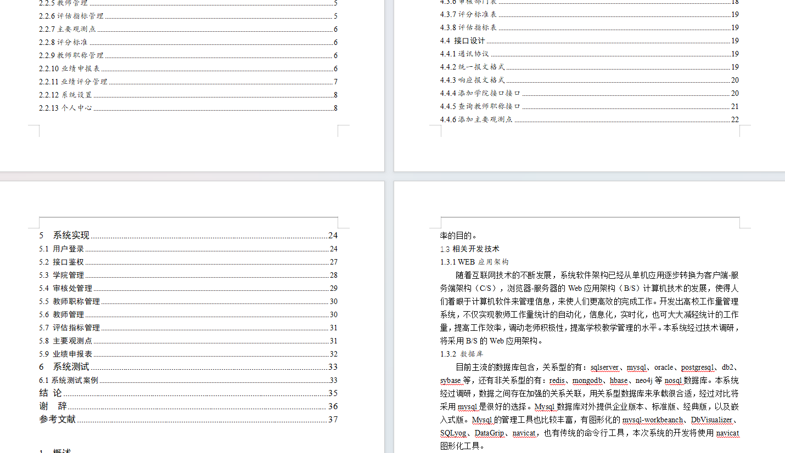
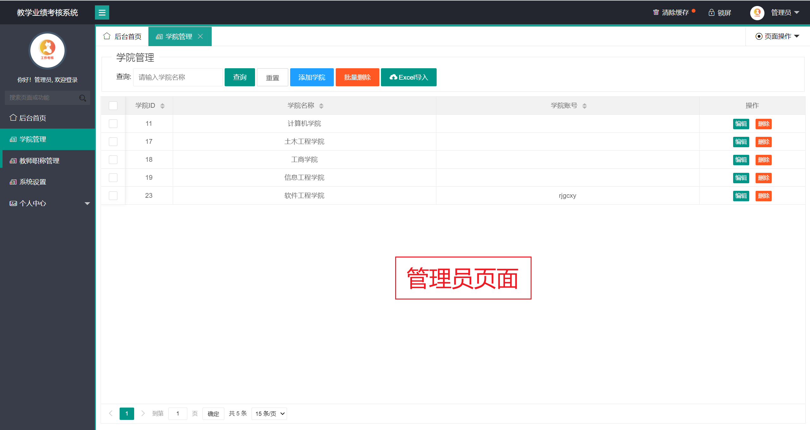
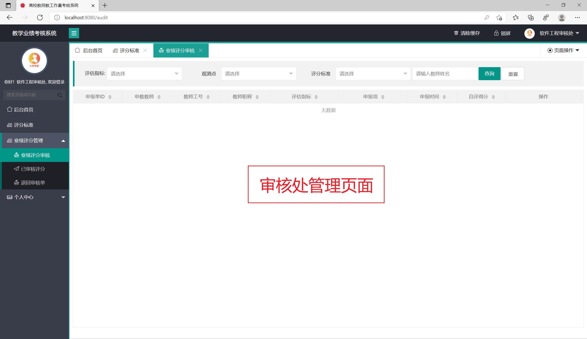

基于SSM的高校工作量统计系统
=
### 完整代码获取地址：从戎源码网 ([https://armycodes.com/](https://armycodes.com/))
### 作者微信：19941326836  QQ：952045282 
### 承接计算机毕业设计、Java毕业设计、Python毕业设计、深度学习、机器学习
### 选题+开题报告+任务书+程序定制+安装调试+论文+答辩ppt 一条龙服务
### 所有选题地址https://github.com/nature924/allProject

一、项目介绍
---
基于SSM的高校工作量统计系统(教师教学业绩考核系统）。Javaee项目，SSM项目，

### 
系统分为四个角色：老师、审核处、学院管理员、管理员
本系统采用当下主流的互联网开发框架技术,包括SpringMVC、Spring、Mybatis和Javascript、MySQL等，设计和实现了一个基于JAVA的高校工作量统计系统。该系统包含了后台首页、审核处管理、教师管理、评估指标管理、主要观测点、评分标准、业绩评分管理、系统管理、个人中心等模块。本系统界面操作便捷，系统也易于维护和扩展，同时有较高的安全性。

二、项目技术
---
- 编程语言：Java
- 数据库：MySQL
- 项目管理工具：Maven
- 前端技术：JSP、HTML、Jquery、Layui、ECharts
- 后端技术：Spring、SpringMVC、MyBatis

三、运行环境
---
- 操作系统：Windows、macOS都可以
- JDK版本：JDK1.8以上都可以
- 开发工具：IDEA、Ecplise、Myecplise都可以
- 数据库: MySQL5.7以上都可以
- Tomcat：任意版本都可以
- Maven：任意版本都可以

四、运行截图
---
### 论文截图：

### 程序截图：

